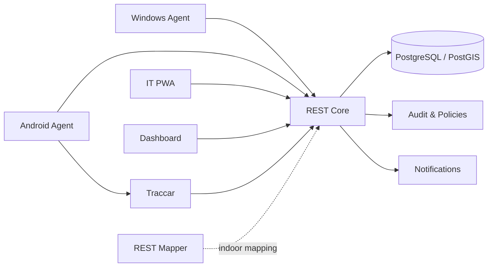

# REST Gentill

**Enterprise Asset Intelligence & Tracking Platform**

[](#)
[](#)
[](#)

> 🇧🇷 [Versão em Português](README.md)

REST Gentill is a corporate platform designed to connect **asset management, endpoint identity, custody and location** without collapsing those responsibilities into a single source of truth.

Its architecture is built around an explicit principle:

```text
Asset ≠ Device ≠ Agent Installation ≠ Last Position
```

## The problem

Enterprise IT operations often need to answer several different questions at once:

- What is the physical asset?
- Which endpoint represents that asset?
- Who is responsible for it?
- Where should it be?
- Where was it last seen?
- Which agent installation is authorized to report?
- Who changed each state?

Treating all of those as the same entity leads to fragile identity, poor auditability and tightly coupled integrations.

## The solution

REST Gentill separates authorities by domain:

| Domain | Authority |
| --- | --- |
| Asset, custody and endpoint identity | **REST Core** |
| Dynamic location and GPS history | **Traccar** |
| Persistent and geospatial data | **PostgreSQL / PostGIS** |
| Administrative operations | **Dashboard** |
| Mobile field operations | **IT PWA** |
| Windows endpoint telemetry | **Windows Agent** |
| Android endpoint telemetry | **Android Agent** |
| Indoor environment mapping | **REST Mapper** |

## Architecture



## 30-second portfolio snapshot

| Dimension | Evidence in the case |
| --- | --- |
| **Product thinking** | product surfaces, domain boundaries and operational workflows modeled as one coherent system |
| **System architecture** | Core, telemetry, agents, PWA, persistence and observability separated by responsibility |
| **Security engineering** | OIDC/RBAC, machine credentials, DPAPI, file-based secrets and audit trails |
| **Cross-platform** | Web, PWA, Windows, Android and Linux control plane |
| **Data architecture** | PostgreSQL/PostGIS and endpoint identity independent from MAC/IP |
| **Operational maturity** | backup/restore, rollback, homologation and contract compatibility |

## Engineering highlights

### Identity

- physical asset separated from endpoint identity;
- agent installation modeled independently;
- MAC, IP and hostname treated as metadata;
- machine credentials are individual and revocable.

### Security

- OIDC for human identity;
- RBAC;
- machine enrollment;
- DPAPI on Windows;
- secure storage on Android;
- file-based secrets;
- auditable administrative operations.

### Telemetry

- REST Core remains the domain authority;
- Traccar remains the location authority;
- PostGIS supports geospatial context;
- static location and dynamic position are not conflated.

### Multi-platform

- React/TypeScript web dashboard;
- PWA for field operations;
- native Windows Agent in .NET;
- native Android Agent in Kotlin;
- Linux control plane.

## Technology stack

| Area | Technologies |
| --- | --- |
| Backend | Python, FastAPI, SQLAlchemy, Alembic |
| Data | PostgreSQL, PostGIS |
| Frontend | React, TypeScript, Vite |
| Mapping | Leaflet, PMTiles, Traccar |
| Windows | .NET Worker Service, DPAPI |
| Android | Kotlin, WorkManager, Android Keystore |
| Infrastructure | Linux, Docker Compose, Caddy |
| Observability | Prometheus, Grafana |
| Identity | OIDC, JWT, RBAC |

## My role

**Vinícius Vilaverde — Product & System Architecture**

Responsibilities across the case:

- product conception and direction;
- system architecture;
- domain modeling;
- integration design;
- operational UX direction;
- security architecture;
- Windows/Android agent strategy;
- infrastructure architecture;
- technical governance and contract evolution.

## Deep dive

- [Portfolio Snapshot](docs/public/PORTFOLIO_SNAPSHOT.md)
- [Technical Impact](docs/public/TECHNICAL_IMPACT.md)
- [Case Study](docs/public/CASE_STUDY.md)
- [Engineering Decisions](docs/public/ENGINEERING_DECISIONS.md)
- [Architecture](docs/public/ARCHITECTURE.md)
- [Security Model](docs/public/SECURITY_MODEL.md)
- [Threat Model](docs/public/THREAT_MODEL.md)
- [Data Ownership Map](docs/public/DATA_OWNERSHIP.md)
- [Technology Rationale](docs/public/TECHNOLOGY_RATIONALE.md)
- [Public Roadmap](docs/public/ROADMAP.md)
- [Publication Assurance](docs/public/PUBLICATION_ASSURANCE.md)

## Publication model

This public repository contains **documentation only**.

The following remain private:

- source code;
- compiled agents;
- installers and APKs;
- operational infrastructure;
- backups and dumps;
- credentials;
- homologation data;
- internal evidence.

## License

Copyright © 2026 REST Gentill. All rights reserved.

See [LICENSE](LICENSE).
