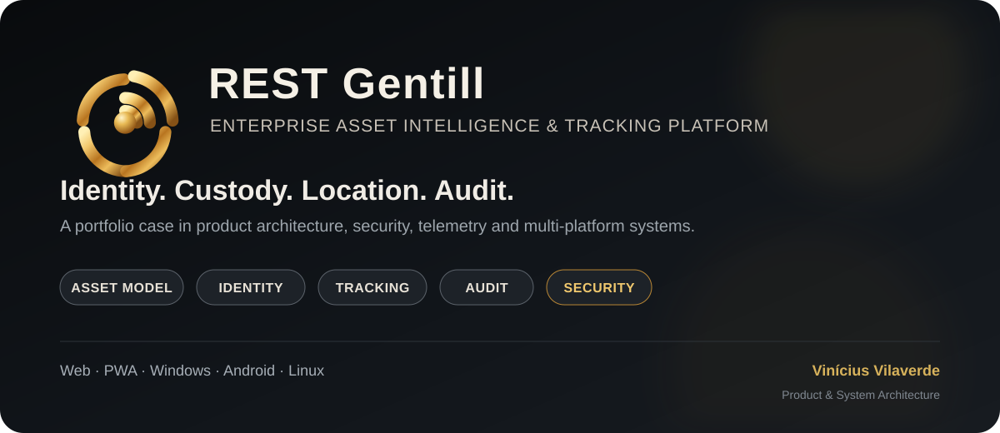
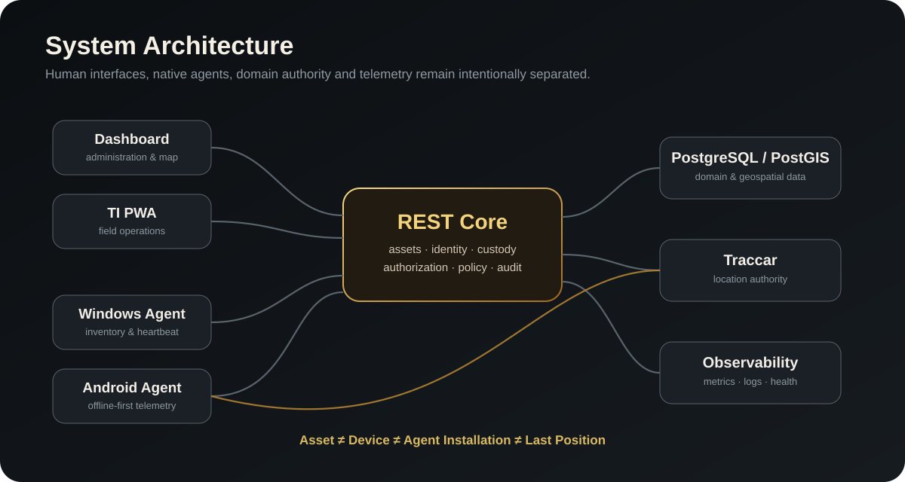
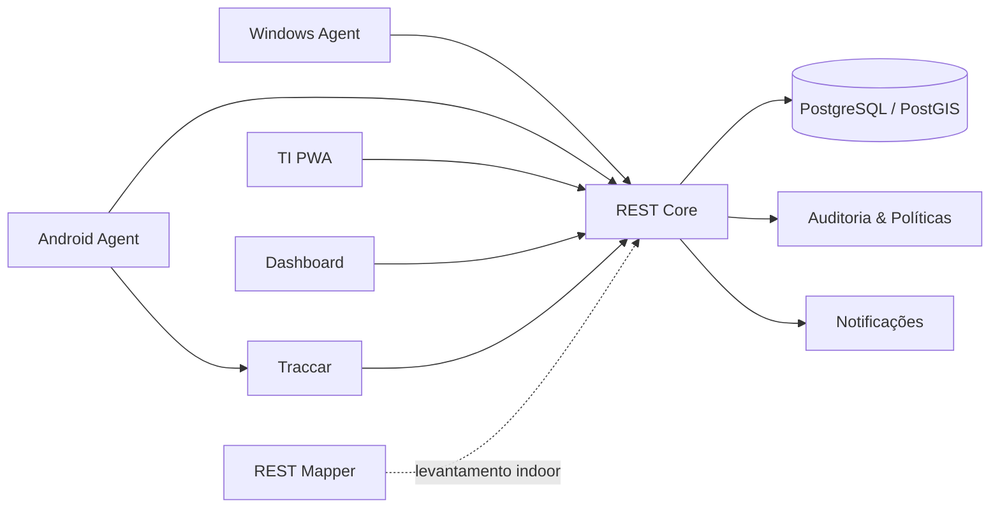

# REST Gentill

<p align="center"></p>

<p align="center"><strong>🇧🇷 Português</strong> · <a href="README.en.md">🇺🇸 English</a></p>

**Enterprise Asset Intelligence & Tracking Platform**

[](#)
[](#)
[](#)
[](https://github.com/viniciusvilaverd-22/GENTILL-RAST/actions/workflows/publication-guard.yml)

[](#)
[](#)
[](#)
[](#)
[](#)
[](#)

Plataforma corporativa para **inventário, custódia, identidade de endpoints e localização de ativos**.

O REST Gentill foi projetado para resolver um problema recorrente em operações de TI: sistemas de patrimônio, localização e responsabilidade frequentemente tratam **ativo, dispositivo, usuário e posição como se fossem a mesma coisa**.

A arquitetura do REST Gentill separa essas responsabilidades e mantém cada domínio auditável.

---

## 30-second portfolio snapshot

**REST Gentill demonstra uma atuação de produto e engenharia de ponta a ponta.**

| Dimensão | Evidência no case |
| --- | --- |
| **Product thinking** | problema, domínio, superfícies e fluxo operacional definidos como um sistema único |
| **System architecture** | Core, telemetria, agentes, PWA, persistência e observabilidade separados por responsabilidade |
| **Security engineering** | OIDC/RBAC, credenciais de máquina, DPAPI, secrets por arquivo e auditoria |
| **Cross-platform** | Web, PWA, Windows, Android e Linux control plane |
| **Data architecture** | PostgreSQL/PostGIS, telemetria dedicada e modelo de identidade não dependente de MAC/IP |
| **Operational maturity** | backup/restore, rollback, homologação e evolução compatível de contratos |

**Meu papel:** Product & System Architecture, direção de produto, UX operacional, segurança, integrações e governança técnica.

➡️ [Portfolio Snapshot](docs/public/PORTFOLIO_SNAPSHOT.md) · [Technical Impact](docs/public/TECHNICAL_IMPACT.md)

---

## Portfolio highlights

| | |
| --- | --- |
| **Produto** | Enterprise Asset Intelligence & Tracking Platform |
| **Escopo** | Produto, arquitetura, UX, backend, agentes, infraestrutura e segurança |
| **Plataformas** | Web, PWA, Windows, Android e Linux |
| **Padrões centrais** | Separação de domínio, identidade de máquina, auditoria, offline-first, OIDC/RBAC |
| **Publicação** | Documentation-only; código-fonte privado |
| **Autor** | Vinícius Vilaverde |

### Product surfaces

| Superfície | Função |
| --- | --- |
| **Dashboard** | Operação administrativa, inventário, auditoria e mapa |
| **TI PWA** | Operação móvel de campo |
| **Windows Agent** | Inventário e heartbeat de endpoints Windows |
| **Android Agent** | Telemetria móvel e operação offline-first |
| **REST Mapper** | Levantamento físico e apoio a mapeamento indoor |

➡️ **[Visão executiva do produto](docs/public/PRODUCT_OVERVIEW.md)**

---

## O problema

Uma operação de ativos corporativos precisa responder, com clareza:

- **o que é o patrimônio?**
- **qual dispositivo representa esse patrimônio?**
- **quem está responsável por ele?**
- **onde ele deveria estar?**
- **onde ele foi visto pela última vez?**
- **qual agente está instalado nesse endpoint?**
- **quem alterou cada informação?**

Misturar essas perguntas em um único identificador ou em uma única fonte de dados cria inconsistência, dificulta auditoria e torna integrações frágeis.

## A solução

O REST Gentill divide o sistema em autoridades explícitas:

| Domínio | Autoridade |
| --- | --- |
| Patrimônio, custódia e identidade | **REST Core** |
| Localização dinâmica e histórico GPS | **Traccar** |
| Persistência e informação geoespacial | **PostgreSQL / PostGIS** |
| Operação administrativa | **Dashboard** |
| Operação móvel de campo | **TI PWA** |
| Telemetria de endpoints Windows | **Windows Agent** |
| Telemetria de endpoints Android | **Android Agent** |
| Levantamento indoor | **REST Mapper** |

---

## Arquitetura

<p align="center"></p>

<details>
<summary><strong>Ver arquitetura em Mermaid</strong></summary>



</details>

### Uma decisão central

```text
Asset ≠ Device ≠ Agent Installation ≠ Last Position
```

Essa separação permite que o sistema mantenha identidade estável sem depender de MAC, IP, hostname ou coordenadas temporárias.

---

## Engineering highlights

### Identity model

- patrimônio físico separado do endpoint;
- instalação do agente identificada individualmente;
- MAC, IP e hostname tratados como metadata;
- credenciais de agentes individuais e revogáveis.

### Security

- OIDC para identidade humana;
- RBAC com papéis canônicos;
- secrets por arquivo no runtime protegido;
- DPAPI no Windows;
- armazenamento seguro no Android;
- trilha de auditoria para operações administrativas.

### Tracking

- telemetria dinâmica separada do domínio patrimonial;
- integração dedicada com Traccar;
- geocercas e políticas operacionais;
- PostGIS para contexto geoespacial.

### Endpoint architecture

- Windows Agent nativo em .NET;
- Android Agent nativo em Kotlin;
- Android offline-first;
- TI PWA como terminal de operação — **não como agente de rastreamento**.

### Infrastructure

- control plane Linux;
- runtime containerizado;
- backup e restore verificáveis;
- observabilidade com Prometheus/Grafana;
- reverse proxy e camada de segurança de borda.

---

## Decisões que diferenciam o projeto

### 1. REST Core não é um servidor de GPS

O Core mantém a verdade patrimonial e operacional.  
A telemetria permanece em uma autoridade especializada.

### 2. PWA não substitui agentes

A PWA é uma ferramenta de campo para a equipe de TI.  
Rastreamento permanente continua nos agentes nativos.

### 3. Device não é identificado por MAC

Interfaces de rede mudam. IP muda. Hostname muda.  
Identidade do endpoint precisa sobreviver a essas alterações.

### 4. Local físico cadastrado não é posição dinâmica

Uma sala de referência de um ativo e a última coordenada conhecida representam fatos diferentes.

### 5. Segurança faz parte da arquitetura

Autenticação, RBAC, enrollment, secrets, auditoria, backup e rollback não foram tratados como camadas posteriores.

Leia mais em [Engineering Decisions](docs/public/ENGINEERING_DECISIONS.md).

---

## Capacidades do produto

- inventário patrimonial e técnico;
- cadastro e identidade de dispositivos;
- enrollment de agentes;
- heartbeat operacional;
- custódia por usuário e setor;
- autorizações de saída e retorno;
- prédios, pisos e salas;
- mapa operacional;
- geocercas;
- políticas operacionais;
- auditoria;
- identidades externas e importações;
- notificações;
- OIDC/RBAC;
- telemetria Windows e Android;
- levantamento indoor.

---

## Stack

| Área | Tecnologias |
| --- | --- |
| Backend | Python, FastAPI, SQLAlchemy, Alembic |
| Data | PostgreSQL, PostGIS |
| Frontend | React, TypeScript, Vite |
| Mapping | Leaflet, PMTiles, Traccar |
| Windows | .NET Worker Service, DPAPI |
| Android | Kotlin, WorkManager, Android Keystore |
| Infrastructure | Linux, Docker Compose, Caddy |
| Observability | Prometheus, Grafana |
| Identity | OIDC, JWT, RBAC |

---

## Meu papel

**Vinícius Vilaverde — Product & System Architecture**

Atuação no projeto:

- concepção e direção do produto;
- arquitetura de sistemas;
- definição do modelo de domínio;
- desenho de integrações;
- direção de UX e experiência operacional;
- segurança e governança técnica;
- estratégia de agentes Windows/Android;
- arquitetura de infraestrutura e homologação;
- decisões de evolução e compatibilidade de contratos.

O objetivo do projeto não é apenas construir funcionalidades, mas manter uma plataforma **auditável, evolutiva e operacionalmente coerente**.

---

## Case study

O case completo documenta:

1. contexto e problema;
2. princípios de arquitetura;
3. decisões técnicas;
4. modelo de identidade;
5. segurança;
6. telemetria;
7. operação de campo;
8. evolução do produto.

➡️ **[Ler o case study](docs/public/CASE_STUDY.md)**

---

## Documentação

- [Portfolio Snapshot](docs/public/PORTFOLIO_SNAPSHOT.md)
- [Technical Impact](docs/public/TECHNICAL_IMPACT.md)
- [Case Study](docs/public/CASE_STUDY.md)
- [Arquitetura](docs/public/ARCHITECTURE.md)
- [Engineering Decisions](docs/public/ENGINEERING_DECISIONS.md)
- [Componentes](docs/public/COMPONENTS.md)
- [Modelo de segurança](docs/public/SECURITY_MODEL.md)
- [Visão de implantação](docs/public/DEPLOYMENT_OVERVIEW.md)
- [Technology Rationale](docs/public/TECHNOLOGY_RATIONALE.md)
- [Política do repositório público](docs/public/REPOSITORY_POLICY.md)

---

## Sobre esta publicação

Este repositório público é uma **versão documental de portfólio**.

Não estão publicados:

- código-fonte;
- agentes compilados;
- APKs ou instaladores;
- infraestrutura operacional;
- dumps ou backups;
- credenciais;
- dados de homologação;
- evidências internas.

O código e os artefatos operacionais do REST Gentill permanecem privados.

---

## Status

**Active development · Architecture documented · Public portfolio case**

Esta documentação apresenta decisões e arquitetura do produto. Ela não representa uma distribuição pronta para produção.

---

## License

Copyright © 2026 REST Gentill. Todos os direitos reservados.

Consulte [LICENSE](LICENSE).
