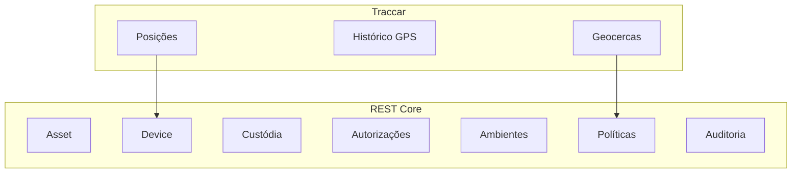

# REST Gentill — Case Study

## Visão

O REST Gentill é uma plataforma de gestão e rastreabilidade de ativos corporativos criada para integrar três dimensões que normalmente aparecem fragmentadas:

1. **patrimônio**;
2. **responsabilidade**;
3. **localização**.

O projeto parte da premissa de que essas dimensões precisam conversar, mas não podem compartilhar a mesma autoridade de dados.

---

## 1. O problema

Sistemas tradicionais de inventário costumam registrar o ativo e sua situação administrativa.

Sistemas de tracking registram posição.

Ferramentas de gestão de dispositivos registram características técnicas do endpoint.

O problema aparece quando a organização tenta responder perguntas que atravessam esses domínios:

- este notebook ainda representa o mesmo patrimônio depois de trocar placa de rede?
- o equipamento está em uma sala porque foi cadastrado ali ou porque foi observado ali?
- quem tem responsabilidade administrativa sobre o ativo?
- qual instalação do agente está autorizada a reportar telemetria?
- quem alterou o cadastro?
- como revogar um dispositivo sem apagar seu histórico?

O REST Gentill foi estruturado para responder essas perguntas mantendo cada conceito separado.

---

## 2. Modelo de domínio

### Asset

Representa o patrimônio físico.

Pode estar associado a:

- setor;
- responsável;
- ambiente físico;
- informações patrimoniais.

### Device

Representa o endpoint computacional vinculado ao ativo.

Um Device não depende de MAC, IP ou hostname para existir.

### Agent Installation

Representa uma instalação específica do agente.

Isso permite:

- enrollment;
- credencial individual;
- revogação;
- rotação;
- diferenciação entre dispositivo e software instalado.

### Telemetry

Representa observações dinâmicas.

Localização, bateria, uptime e heartbeat são fatos temporais — não identidade.

---

## 3. Separação de autoridades

Uma das principais decisões foi não transformar o Core em uma solução monolítica.



O Core controla o domínio patrimonial.

Traccar controla telemetria.

Essa divisão reduz acoplamento e evita transformar coordenadas temporárias em atributos permanentes do patrimônio.

---

## 4. Arquitetura de endpoints

### Windows

O endpoint Windows utiliza agente nativo.

Princípios:

- execução como serviço;
- identidade persistente da instalação;
- credencial individual;
- segredo protegido com DPAPI;
- heartbeat;
- inventário técnico;
- atualização com rollback.

### Android

O Android Agent foi desenhado para ambiente móvel.

Princípios:

- permissões explícitas;
- operação em background compatível com Android;
- offline-first;
- fila e sincronização;
- armazenamento seguro;
- integração de localização com Traccar.

### TI PWA

A PWA é propositalmente diferente.

Ela é uma ferramenta operacional para técnicos em campo.

A PWA:

- consulta inventário;
- acessa mapa;
- identifica ativos;
- apoia operações de campo.

Ela **não se torna uma fonte de tracking permanente**.

---

## 5. Segurança

O projeto trata segurança como parte da arquitetura.

### Identidade humana

- OIDC;
- JWT;
- RBAC.

### Identidade de máquinas

- enrollment;
- Installation ID;
- credencial individual;
- revogação.

### Segredos

- suporte a secrets por arquivo;
- nenhum segredo deve depender do repositório;
- proteção local específica por plataforma.

### Auditoria

Ações administrativas relevantes precisam registrar ator e contexto.

---

## 6. Ambientes físicos

O modelo físico utiliza:

```text
Building
  └─ Floor
      └─ Room
```

O local cadastrado de um ativo representa **referência operacional**.

Isso não substitui sua posição dinâmica.

Essa distinção é importante principalmente para notebooks, dispositivos móveis e equipamentos temporariamente deslocados.

---

## 7. Infraestrutura

O control plane foi estruturado para Linux e containers.

A arquitetura de infraestrutura considera:

- persistência;
- isolamento de serviços;
- reverse proxy;
- TLS;
- logging;
- observabilidade;
- backup;
- restore;
- rollback.

Backup só é considerado confiável quando existe um caminho de restore verificável.

---

## 8. Governança técnica

O projeto utiliza decisões arquiteturais documentadas e evolução explícita de contratos.

Objetivos:

- evitar breaking changes acidentais;
- manter compatibilidade entre agentes e Core;
- separar baseline estável de candidatas;
- registrar decisões relevantes;
- tornar rollback uma capacidade real.

---

## 9. Resultado arquitetural

O REST Gentill se torna uma plataforma em que:

```text
Patrimônio
   │
   ├── identidade
   ├── responsabilidade
   ├── ambiente de referência
   │
Device
   │
   ├── instalação do agente
   ├── credencial
   ├── inventário técnico
   │
Telemetry
   │
   ├── heartbeat
   ├── localização
   ├── uptime
   └── bateria
```

Cada camada mantém seu próprio significado.

---

## 10. Atuação no projeto

**Vinícius Vilaverde**

Áreas conduzidas no desenvolvimento do case:

- visão de produto;
- arquitetura de sistemas;
- modelagem de domínio;
- integrações;
- UX operacional;
- segurança;
- infraestrutura;
- estratégia de agentes;
- governança técnica.

---

## Conclusão

O principal objetivo arquitetural do REST Gentill não é simplesmente rastrear equipamentos.

É criar uma plataforma em que **identidade, patrimônio, responsabilidade e localização possam evoluir juntas sem serem confundidas**.
