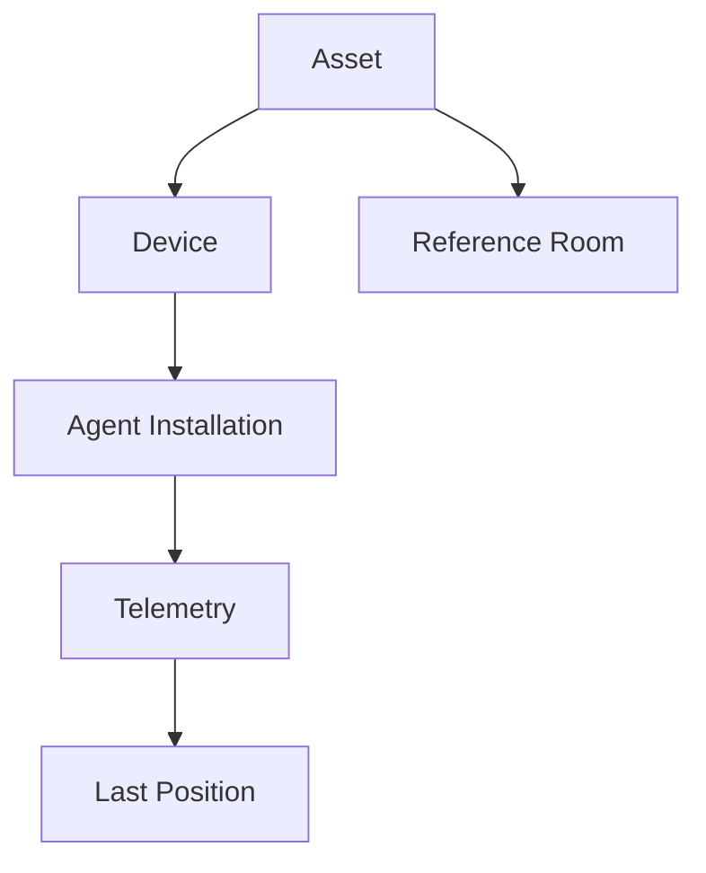

# REST Gentill — Data Ownership Map

A core design goal of REST Gentill is avoiding ambiguous sources of truth.

This map describes which subsystem owns each category of information.

## Ownership matrix

| Data / Responsibility | Authority | Notes |
| --- | --- | --- |
| Asset identity | REST Core | physical/business asset |
| Device identity | REST Core | endpoint associated with an asset |
| Agent installation identity | REST Core + endpoint | persistent installation context |
| Human identity | External IdP | consumed by Core through OIDC |
| Human authorization | REST Core | RBAC and policy |
| Custody | REST Core | responsibility over an asset |
| Exit/return authorization | REST Core | business authorization |
| Building / Floor / Room | REST Core | static physical hierarchy |
| Home/reference room | REST Core | static asset context |
| Last GPS position | Traccar | dynamic observation |
| GPS history | Traccar | telemetry history |
| Geofence telemetry | Traccar | location-domain event |
| Policy interpretation | REST Core | business/operational meaning |
| Audit trail | REST Core | administrative accountability |
| Operational metrics | Observability stack | system health, not business truth |

## Static vs dynamic location

One of the most important ownership boundaries is:

```text
Asset.home_room = static operational reference
Last Position   = dynamic telemetry observation
```

They answer different questions.

### Static reference

Answers:

> Where does this asset belong operationally?

### Dynamic telemetry

Answers:

> Where was this endpoint observed?

The system intentionally does not force those facts into one authority.

## Identity hierarchy



## Why MAC, IP and hostname do not own identity

MAC, IP and hostname can change because of:

- interface replacement;
- network changes;
- virtualization;
- DHCP;
- device rename;
- reinstallations.

Therefore they remain metadata.

They may help identify or diagnose an endpoint, but they do not become the authoritative identity key.

## Human vs machine authority

```text
Human Identity  -> IdP / OIDC -> REST Core authorization
Machine Identity -> enrollment / device credential -> REST Core agent boundary
```

A machine credential must not become a human administrative session.

## Telemetry integration

Traccar owns location mechanics.

REST Core may consume telemetry to apply business meaning, such as:

- policy evaluation;
- asset context;
- operational alerting.

This preserves specialization:

```text
Traccar = where/when
REST Core = what it means for the business domain
```

## Design outcome

Explicit ownership provides:

- fewer conflicting states;
- clearer integration contracts;
- safer migrations;
- easier auditability;
- simpler incident analysis;
- stronger long-term evolvability.
