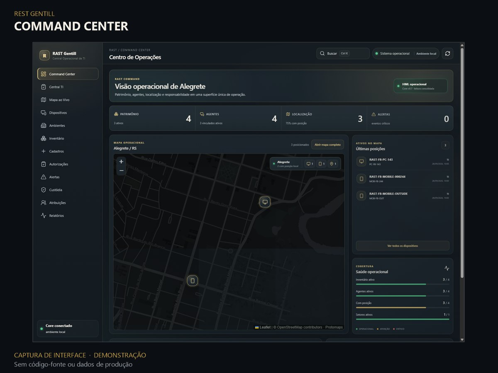
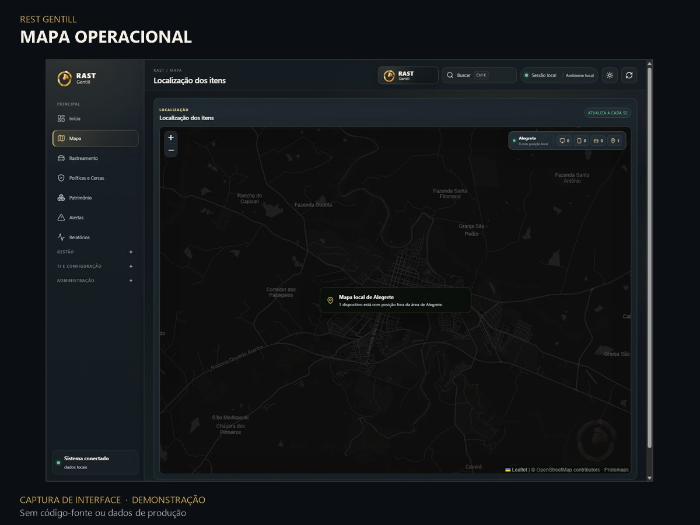
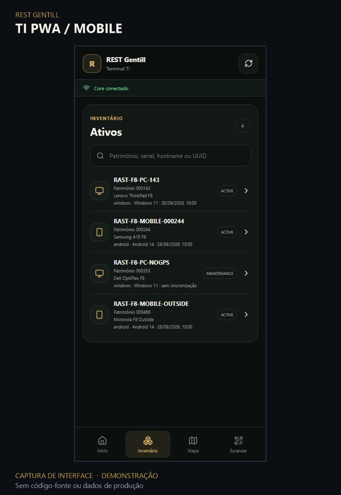
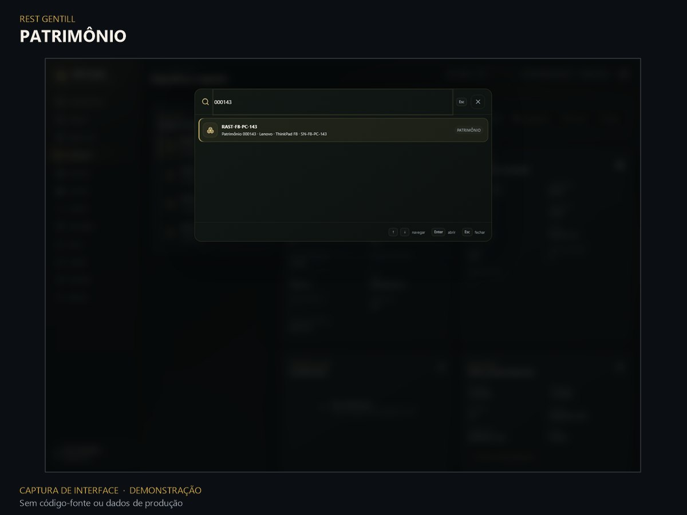

# Product Gallery

Imagens do produto REST Gentill preparadas para apresentação pública.

> **Contexto:** capturas de interface provenientes de testes locais, reprocessadas para portfólio. Command Center, busca patrimonial e PWA utilizam fixtures demonstrativas. O mapa é uma captura de QA local, sem divulgação de coordenadas ou identificação individual de dispositivos. Estas imagens não representam um ambiente de produção.

## Principais superfícies

### Command Center

Visão consolidada com inventário, agentes, localização e informações operacionais, utilizando dados de demonstração.

### Mapa operacional

Interface de mapa em ambiente de testes local. Mostra a experiência cartográfica sem publicar posição individual de equipamentos.

### TI PWA

Terminal móvel de campo para consulta de ativos. A PWA não substitui os agentes nativos de rastreamento.

## Detalhe adicional: busca patrimonial

Busca rápida com resultado demonstrativo. É uma captura de um componente de interface, não a tela completa de gestão patrimonial.

---

## Escopo da publicação

- Arquivos JPEG novos, derivados de capturas autorizadas para revisão.
- Originais de QA e arquivos intermediários permanecem fora do GitHub.
- Não contém código-fonte, segredos, dumps, endereços de infraestrutura ou dados de produção.
- Status, nomes de dispositivos e totais exibidos em fixtures não são métricas reais de clientes.
- O uso de mapa não representa autorização para rastreamento individual nem demonstra operação produtiva.

**[Voltar ao portfólio](../../README.md)** · **[English overview](../../README.en.md)**
