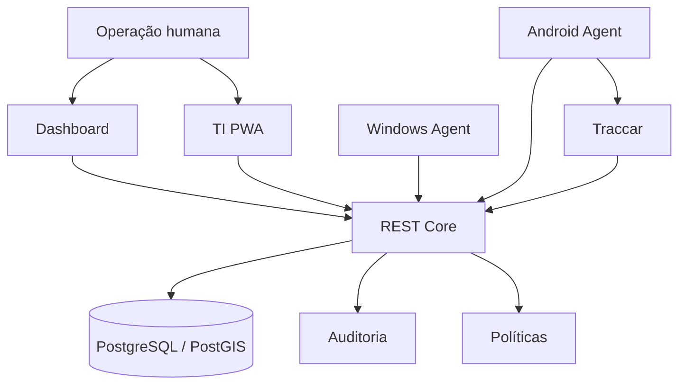

# REST Gentill — Product Overview

## Em uma frase

O REST Gentill é uma plataforma corporativa para conectar **patrimônio, identidade de endpoints, responsabilidade e localização** sem misturar essas autoridades em um único modelo.

## O que o projeto demonstra

Este case de portfólio evidencia capacidade de atuar de ponta a ponta em um produto técnico complexo:

- visão e direção de produto;
- modelagem de domínio;
- arquitetura distribuída;
- backend e integrações;
- UX operacional;
- segurança;
- identidade humana e de máquinas;
- agentes nativos Windows e Android;
- telemetria e geolocalização;
- infraestrutura Linux e containers;
- observabilidade;
- governança técnica e evolução de contratos.

## Superfícies do produto

### Dashboard

Interface administrativa para inventário, dispositivos, ambientes, custódia, autorizações, auditoria e mapa operacional.

### TI PWA

Terminal móvel para operação de campo da equipe de TI.

A PWA foi desenhada para pessoas e não substitui agentes permanentes de telemetria.

### Windows Agent

Agente nativo em .NET para inventário técnico, identidade da instalação e heartbeat.

### Android Agent

Agente nativo em Kotlin com operação offline-first e integração de localização.

### REST Mapper

Ferramenta separada para levantamento físico e apoio a ambientes indoor.

## Sistema em camadas



## Princípio de identidade

```text
Asset ≠ Device ≠ Agent Installation ≠ Last Position
```

Esse modelo evita usar valores voláteis como MAC, IP, hostname ou coordenadas temporárias como identidade do endpoint.

## O que diferencia o case

### Separação de autoridades

O Core mantém patrimônio, responsabilidade e identidade.

Traccar mantém telemetria e histórico de localização.

### Segurança de ponta a ponta

- OIDC/RBAC para pessoas;
- credenciais individuais para agentes;
- proteção local de secrets por plataforma;
- auditoria de operações administrativas;
- secrets por arquivo em runtime protegido.

### Arquitetura multi-plataforma

- Web;
- PWA;
- Windows;
- Android;
- Linux control plane.

### Evolução controlada

O projeto utiliza contratos versionados, migrations, validações e distinção entre baseline e candidata para reduzir regressões.

## Papel de Vinícius Vilaverde

Atuação principal:

- concepção e direção do produto;
- arquitetura de sistemas;
- definição de domínio;
- desenho de integrações;
- direção de UX;
- segurança;
- infraestrutura;
- estratégia de agentes;
- governança técnica.

## Próxima leitura

- [Case Study](CASE_STUDY.md)
- [Engineering Decisions](ENGINEERING_DECISIONS.md)
- [Arquitetura](ARCHITECTURE.md)
- [Modelo de Segurança](SECURITY_MODEL.md)
