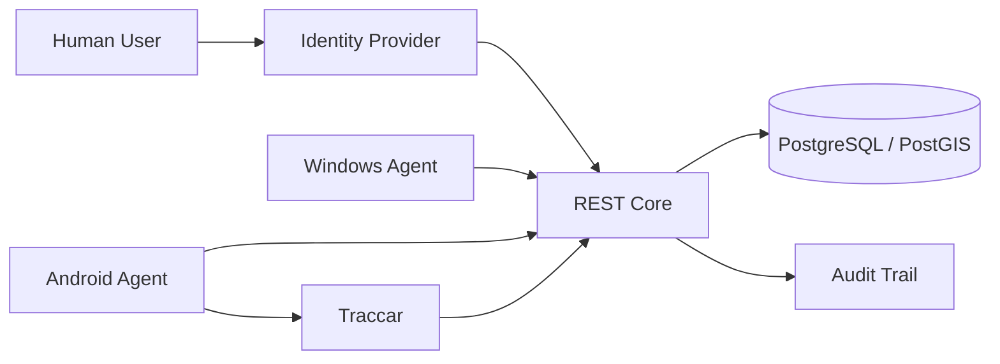

# REST Gentill — Public Threat Model

This document presents a portfolio-level security model. It intentionally omits private endpoints, credentials, internal addresses and implementation-sensitive controls.

## Security objectives

REST Gentill must preserve:

- endpoint identity;
- asset integrity;
- custody history;
- authorization integrity;
- telemetry authenticity;
- auditability;
- credential confidentiality;
- recoverability.

## Primary assets

| Asset | Why it matters |
| --- | --- |
| Agent credentials | authorize machine-originated operations |
| Human identity tokens | authorize administrative access |
| Asset records | represent physical ownership and lifecycle |
| Device identity | binds endpoints to the operational model |
| Custody history | records responsibility |
| Location telemetry | represents dynamic position |
| Audit records | support accountability |
| Backup material | supports recovery |

## Trust boundaries

The key trust boundaries are:

1. human identity → Core;
2. machine identity → Core;
3. Android telemetry → Traccar;
4. Traccar integration → Core;
5. Core → persistent data;
6. administration → audit trail.

## Threat classes

### Credential disclosure

**Risk:** a leaked agent or human credential is reused.

**Mitigations documented by the architecture:**

- separate human and machine trust models;
- individual agent credentials;
- revocation capability;
- platform-specific local secret protection;
- secrets outside source control.

### Endpoint impersonation

**Risk:** an attacker attempts to impersonate an existing Device.

**Mitigations:**

- endpoint identity does not depend on MAC/IP/hostname;
- installation identity is persistent;
- enrollment and machine credentials are distinct lifecycle concepts.

### Privilege confusion

**Risk:** a machine credential gains human administrative authority.

**Mitigation:**

- human OIDC/RBAC and agent credentials are separate authorization paths.

### Telemetry spoofing

**Risk:** false location data is accepted as trusted business-domain state.

**Mitigations:**

- location is treated as telemetry;
- telemetry authority remains separate from static asset location;
- REST Core does not redefine last position as asset identity.

### Unauthorized administrative changes

**Risk:** a valid user performs or attempts an action beyond their role.

**Mitigations:**

- role-based access control;
- administrative actions are auditable;
- policy and authorization are explicit Core responsibilities.

### Secret exposure through deployment

**Risk:** credentials leak through repository files or runtime configuration.

**Mitigations:**

- public repository guard rejects sensitive material;
- production-oriented configuration supports file-based secrets;
- private operational configuration remains outside the public repository.

### Data loss

**Risk:** database or service failure destroys business history.

**Mitigations:**

- backup is paired with restore validation;
- rollback is treated as an explicit capability;
- persistence responsibilities are separated from application containers.

## Security boundaries by platform

### Windows

Primary controls:

- native service lifecycle;
- DPAPI for local secret protection;
- installation identity separate from volatile host metadata.

### Android

Primary controls:

- Android platform permissions;
- secure local storage;
- background execution through platform-compatible mechanisms;
- offline-first synchronization.

### Human interfaces

Primary controls:

- OIDC;
- RBAC;
- no reuse of machine credentials for human administration.

## Public repository controls

The portfolio repository is intentionally documentation-only.

Automated CI rejects:

- product source directories;
- generated binaries;
- environment files;
- obvious credential patterns;
- unwanted assistant-attribution markers.

## Non-goals of this public document

This document does not publish:

- internal network topology;
- production endpoints;
- credentials;
- exact firewall rules;
- secret locations;
- exploit scenarios;
- private operational runbooks.

## Principle

Security follows the same architectural rule as the rest of REST Gentill:

> Different trust domains must remain different identities with different authorities.
